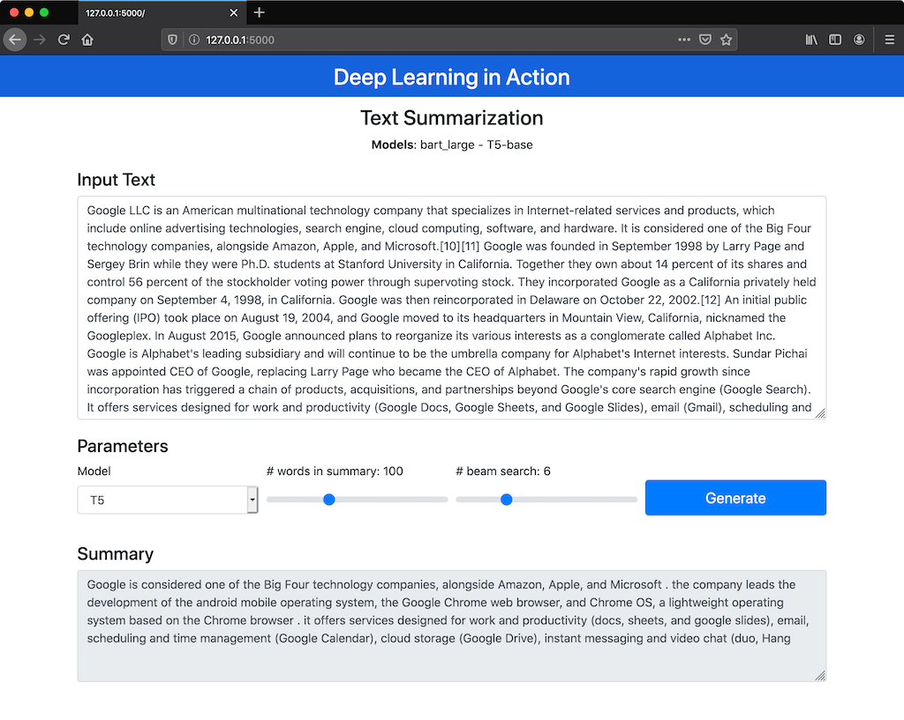

# Bart_T5-summarization
Summarization Task using Bart and T5 models from [HugginFace Transformers](https://github.com/huggingface/transformers)

It is possible to directly compare the best models for text summarization Bart and T5.

## Install requeriments
```
pip install -U transformers
pip install -U torch
pip install flask
```

## Run
```
python app.py
```

### Bart Summarization


### T5 Summarization

